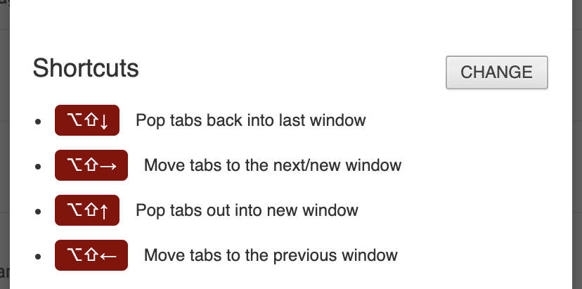

# Overview

> speeds up tab management with simple shortcuts

How most people move tabs between window

1. Select and drag out the tabs to a new window
2. Verify the desired destination window is visible below
3. Select and drags tabs to the destination window

That's frustrating and cumbersome especially when you prefer running your browser maximised.

`CATS` provides key bindings for moving multiple tabs between already open chrome windows.

## Install

[Chrome Web Store](https://chrome.google.com/webstore/detail/alt-tab-shortcuts/ebdcpdepkbefmgfdkdplcmhfkddagfon)

## Configure

View the [options](chrome://extensions/?options=nhdnpkpelibodokklomapifnabkhbaba) page to access or change the shortcuts.

## Contribute

See the [contribution guide](https://github.com/iamogbz/chrome-alt-tabs/blob/master/CONTRIBUTING.md) for local development and testing!

## Extras

Combine with the following extensions, for the ultimate chrome tab control:

- [Reorder Tabs Shortcuts](https://chrome.google.com/webstore/detail/keyboard-shortcuts-to-reo/moigagbiaanpboaflikhdhgdfiifdodd)
- [Tab to Window/Popup](https://chrome.google.com/webstore/detail/tab-to-windowpopup-keyboa/adbkphmimfcaeonicpmamfddbbnphikh)
